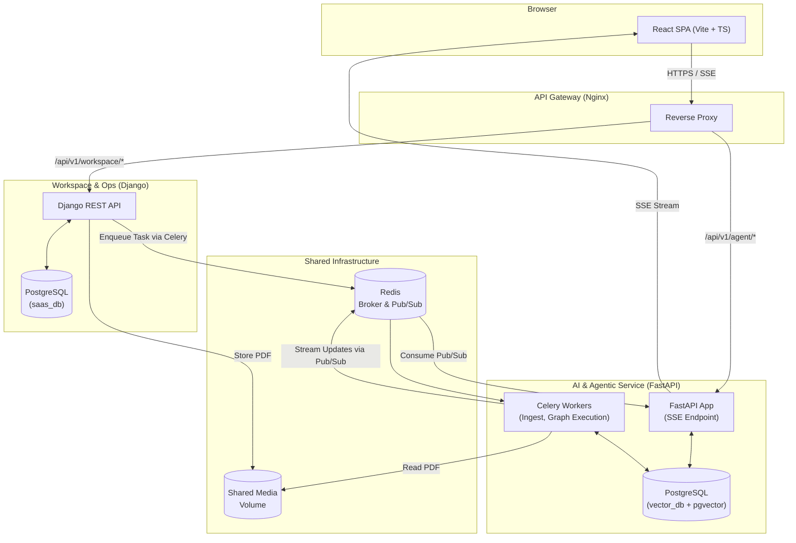

<div align="center">
  
  
  
  
  
  
  <h1>Fin Agent: AI Finance & Accounting Orchestrator</h1>
  <p>An enterprise-grade, agentic AI platform designed for accounting firms, tax professionals, and financial analysts to automate research, document retrieval, and workflow operations.</p>
</div>

---

## 🎯 Scope and Vision
Fin Agent is designed to bridge the gap between traditional SaaS accounting workspaces and cutting-edge Agentic AI. Inspired by platforms like Taxxa.ai, this system provides a secure, multi-tenant environment where accounting professionals can seamlessly manage clients and tasks alongside a powerful, autonomous AI agent. 

The AI agent is capable of ingesting massive tax documents, performing multi-step reasoning, retrieving exact citations using vector search, and streaming verified answers back to the user in real-time.

---

## 🏗 Architecture Overview

The platform is built using a **decoupled microservices architecture** orchestrated via Docker Compose. We strictly separate the transactional B2B SaaS logic from the computationally heavy AI and vector ingestion pipelines.



---

## 💻 Technical Stack

### 1. Frontend Client (Workspace UI)
- **Framework**: React 18 with Vite and TypeScript.
- **Styling**: Tailwind CSS with custom glassmorphism and modern UI components.
- **Key Features**: 
  - Real-time event streaming via Server-Sent Events (SSE).
  - Dynamic "Agent Reasoning" stepper showing live LangGraph nodes.
  - Interactive citations drawer to audit LLM claims against original source text.
  - Drag-and-drop document upload interface.

### 2. Workspace & Ops Service (Django)
- **Framework**: Django 5.0 + Django REST Framework (DRF).
- **Database**: PostgreSQL (Relational schema).
- **Key Features**:
  - **Row-Level Security (RLS)**: Enforced via custom Django middleware to guarantee strict tenant isolation across organizations.
  - **Authentication**: JWT-based stateless authentication (`djangorestframework-simplejwt`).
  - **Entity Management**: CRUD APIs for Clients, Engagements, Tasks, and Documents.

### 3. AI & Agentic Service (FastAPI)
- **Framework**: FastAPI (Asynchronous web framework).
- **Orchestration**: LangGraph and LangChain.
- **Database**: PostgreSQL with `pgvector` extension.
- **LLM Integration**: Configured for Azure AI Studio (OpenAI Compatible API) using `ChatOpenAI` and `OpenAIEmbeddings`.
- **Key Features**:
  - Exposes streaming endpoints (`text/event-stream`) to pipe token-by-token LLM output directly to the browser.
  - Intercepts Redis Pub/Sub channels to asynchronously feed UI updates.

### 4. Background Processing (Celery & Redis)
- **Broker & Cache**: Redis 7.
- **Task Queue**: Celery workers handle heavy lifting asynchronously to prevent API blocking.

---

## ⚙️ Core Pipelines

### 1. Document Ingestion Pipeline
To provide the AI with firm-specific context, documents must be ingested and vectorized:
1. **Upload**: User drags a PDF into the React UI.
2. **Storage**: The Django API receives the file, stores it in a shared Docker volume, creates a `Document` database record, and fires a Celery task.
3. **Parsing**: The Celery worker picks up the task, reads the PDF using `PyMuPDF` (fitz), and extracts raw text.
4. **Chunking**: LangChain's `RecursiveCharacterTextSplitter` breaks the document into overlapping 1000-character chunks.
5. **Embedding**: Chunks are passed through `text-embedding-3-small` (via Azure OpenAI) to generate high-dimensional vectors.
6. **Vector DB**: Embeddings and metadata (Tenant ID, Document ID) are stored in `pgvector` for rapid similarity search.

### 2. LangGraph Agentic RAG Pipeline
When a user asks a complex financial or tax question, the request is executed via a deterministic state machine (LangGraph) running in a background Celery task:
1. **Router Node**: Classifies the query intent. Decides whether to perform direct retrieval or complex multi-step planning.
2. **Planner Node** *(Optional)*: Decomposes complex queries (e.g., "Compare Lease Rules across US and EU") into specific sub-queries.
3. **Retriever Node**: Executes a similarity search against `pgvector`, filtering strictly by the user's `tenant_id` to ensure absolute data privacy.
4. **Synthesizer Node**: Feeds retrieved contexts to `gpt-4o` to generate a final answer, strictly mandating the use of `[citation:chunk_id]` tags.
5. **Citation Validator Node**: Audits the LLM's draft answer, dropping hallucinated citations and mapping valid citations to exact document excerpts for UI rendering.

As the graph transitions between nodes, the Celery worker pushes JSON state updates to Redis, which FastAPI instantly streams to the React UI to update the visual stepper and typing animation.

---

## 🚀 Getting Started

### Prerequisites
- Docker & Docker Compose
- Azure AI Studio (or OpenAI) API Keys

### Configuration
1. Rename or update the `.env` file at the root of the project.
2. Provide your Azure OpenAI endpoints and API key:
```env
AZURE_OPENAI_API_KEY=<your-api-key>
AZURE_OPENAI_ENDPOINT=https://<your-resource>.services.ai.azure.com/openai/v1
AZURE_OPENAI_CHAT_MODEL=gpt-4o
AZURE_OPENAI_EMBEDDING_MODEL=text-embedding-3-small
```

### Running the Platform
Launch the microservices cluster using Docker Compose:
```bash
docker-compose up -d --build
```

Access the platform:
- **Frontend Workspace**: [http://localhost/](http://localhost/)
- **Django Admin Console**: [http://localhost:8000/admin/](http://localhost:8000/admin/)
- **FastAPI Docs**: [http://localhost:8080/docs](http://localhost:8080/docs)

*(Note: The frontend will automatically provision a sandbox tenant workspace for testing purposes on first load).*
